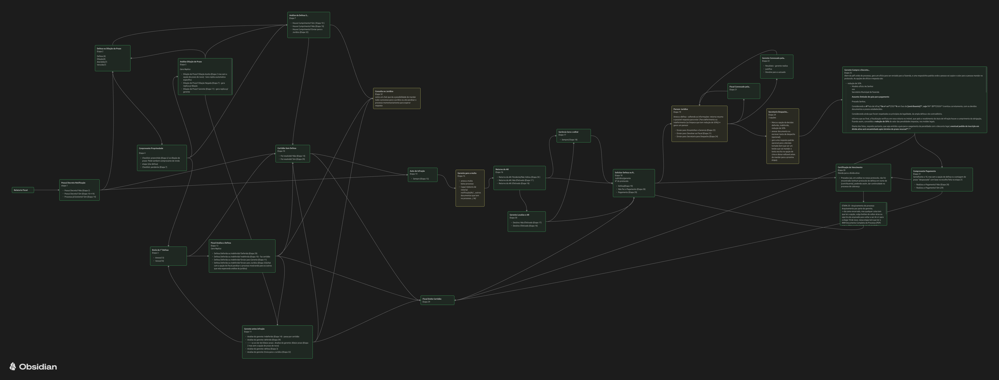
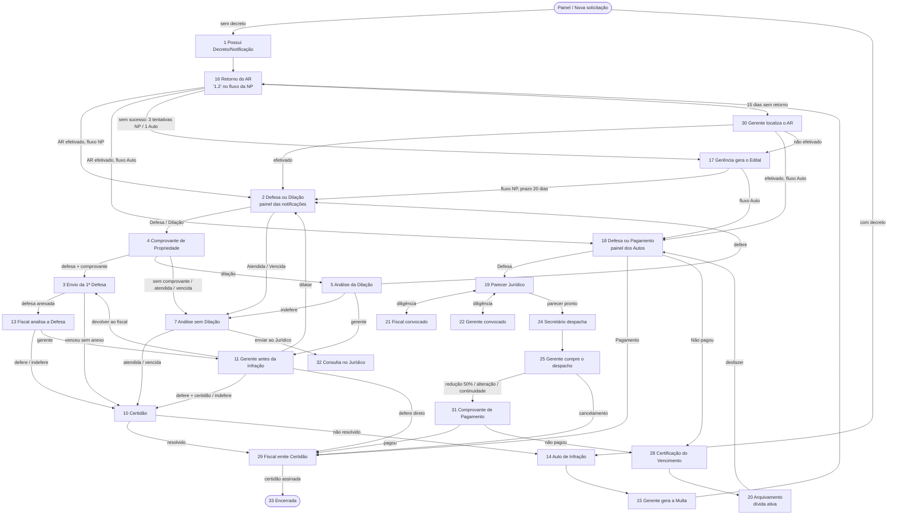

# Sistema Fluxograma — SEMAC / Fiscalização de Posturas

Sistema web que acompanha o processo administrativo de fiscalização de posturas, da
vistoria até o encerramento. O processo começa na Notificação Preliminar, pode virar
Auto de Infração, passar pelo Jurídico e pelo Secretário e terminar em certidão,
pagamento ou arquivamento. Cada passo é uma **etapa** numerada, com um responsável
(cargo), uma tela própria e regras de avanço.

Este documento substitui a antiga pasta `etapas/` (um `.md` por etapa + `Vencimentos.docx`).
Ele descreve **o que o código faz hoje**. Onde a especificação antiga dizia outra coisa,
a diferença está anotada em [Divergências e pendências](#12-divergências-e-pendências).

## Fluxo oficial



[`Fluxograma.png`](Fluxograma.png) é a exportação do canvas do Obsidian e é **o fluxo
oficial**. Se este documento ou o código discordarem da imagem, vale a imagem, e o código
deve ser corrigido. As diferenças conhecidas estão na [seção 12](#12-divergências-e-pendências).

---

## Sumário

1. [Como rodar](#1-como-rodar)
2. [Estrutura do projeto](#2-estrutura-do-projeto)
3. [Conceitos](#3-conceitos)
4. [Cargos e permissões](#4-cargos-e-permissões)
5. [Prazos](#5-prazos)
6. [Mapa do fluxo](#6-mapa-do-fluxo)
7. [Etapas, uma a uma](#7-etapas-uma-a-uma)
8. [Documentos gerados](#8-documentos-gerados)
9. [Telas do painel](#9-telas-do-painel)
10. [Banco de dados](#10-banco-de-dados)
11. [IA da defesa (Etapa 19)](#11-ia-da-defesa-etapa-19)
12. [Divergências e pendências](#12-divergências-e-pendências)
- [Anexo A — Catálogo de infrações](#anexo-a--catálogo-de-infrações)
- [Anexo B — Textos-padrão](#anexo-b--textos-padrão)
- [Anexo C — Pesquisa: argumentos comuns nas defesas](#anexo-c--pesquisa-argumentos-comuns-nas-defesas)

---

## 1. Como rodar

O sistema é um site estático (HTML + JavaScript puro). Não há build. O backend é o
**Supabase** (Postgres + autenticação) e os anexos ficam no **Cloudinary**.

```bash
cd "Área de Trabalho/Fluxograma"
python3 -m http.server 8000
# abrir http://localhost:8000  (index.html = login por CPF e senha)
```

| Página | Para que serve |
|---|---|
| `index.html` | Login (CPF + senha). Script: `assets/js/login.js` |
| `painel.html` | Painel: lista de processos, nova solicitação, ofícios, avisos, instruções, apuração e configurações |
| `etapa.html?processo=<id>[&notificacao=<id>]` | Tela do processo na etapa atual. Com `notificacao`, abre a notificação ou o Auto específico |

Configuração:
- **Supabase:** `assets/js/supabase-config.js`. A chave também aparece repetida em `assets/js/login.js`.
- **Cloudinary:** `assets/js/cloudinary-config.js` (cloud `dsctsogdy`, preset sem assinatura `semac_unsigned`).

Bibliotecas por CDN: supabase-js, pdf-lib, pdf.js, html2canvas, jszip, docx, SheetJS (xlsx) e Chart.js.

---

## 2. Estrutura do projeto

```
index.html, painel.html, etapa.html
Fluxograma.png             fluxo oficial (exportado do canvas do Obsidian)
assets/
  css/style.css, painel.css
  img/                     brasão, logo, ícones
  js/
    login.js               login
    supabase-config.js     cliente Supabase
    cloudinary-config.js   upload de anexos e formatos de imagem aceitos
    solicitacoes.js        painel: lista, filtros, CSV, situação, cores por cargo
    nova-solicitacao.js    Etapa 1: assistente "Novo Processo" (5 passos)
    etapa.js               página de etapa: todas as etapas "clássicas", PDFs, AR, prazos
    etapa19_parecer.js     Etapas 19, 21 e 22 (Jurídico e diligências)
    etapa24_despacho.js    Etapa 24 (Secretário) + PDF unificado do processo
    etapa25_fazenda.js     Etapas 25 (Gerente cumpre o despacho) e 31 (pagamento)
    ia_defesa.js           resumo da defesa com IA local (WebLLM)
    chat_juridico.js       chat com o Gerente de Interface Jurídica
    oficio-modelo.js       papel timbrado do Ofício SEMAC – GFP
    oficio-avulso.js       ofícios avulsos (aba Ofícios do painel)
    brasao-base64.js       brasão embutido para os PDFs
banco_de_dados.sql         esquema do banco (Supabase), exportado por migracao/exportar_esquema.sql
migracao/                  scripts SQL incrementais e migração de anexos (ver LEIA-ME.md)
```

---

## 3. Conceitos

**Processo.** Uma solicitação (tabela `processos`), com contribuinte, imóvel, dados do
fiscal e as infrações marcadas. Tem um número de protocolo único.

**Notificação.** Cada infração marcada na Etapa 1 gera **uma notificação própria**
(tabela `notificacoes`), com número, descrição e prazo próprios. A partir da Etapa 2,
**cada notificação segue o seu caminho**: num mesmo processo uma pode estar atendida,
outra em defesa e outra já virando Auto de Infração.

**Auto de Infração.** Quando a notificação não é cumprida (Etapa 10 → 14), ela vira Auto:
o `status` passa a `auto_infracao` e o número do Auto também é gravado em `autos_infracao`.

**Painéis de etapa.** O processo "mora" num painel enquanto as notificações andam:
- **Etapa 2** é o painel do processo com Notificação Preliminar. O processo fica nela e
  cada notificação mostra em que etapa está.
- **Etapa 18** é o painel dos Autos de Infração. Cada Auto avança pelo seu card, e as
  Etapas 19, 21, 22, 24, 25 e 31 são **por Auto**: o processo continua no painel da 18.

**Dois fluxos de entrada.**
- **Fluxo da Notificação Preliminar (NP):** Etapa 1 → 16 (chamada de **Etapa 1.2** nesse
  fluxo) → 2 → …
- **Fluxo do Decreto:** quando a infração já foi notificada por decreto (ex.: Decreto
  17.326/2026, notificação geral), o processo é criado **direto na Etapa 14** (Auto de Infração).

**Etapas compartilhadas (16, 17 e 30).** O ciclo do AR serve aos dois fluxos. O número
da etapa não basta para saber se o documento é NP ou Auto. Quem decide é o histórico:
se o processo **passou pela Etapa 14**, é o ciclo do Auto (`processoVeioDaEtapa14`).

Cada ciclo guarda **o próprio AR, Edital e Etapa 30**. A Notificação Preliminar tem um AR
para o processo inteiro, em `processos.dados.campos.etapa16/17/30`. Cada Auto de uma
notificação tem o seu, em `processos.dados.campos.ciclos_ar_auto[<id da notificação>]`,
e os anexos do AR do Auto ficam em `documentos` com o `notificacao_id` dele. Use
`camposCicloAR()` nas Etapas 16/17/30 e `camposARParaLeitura()` no resto; nunca
`proc.campos.etapa16` direto.

**Situação** (`notificacoes.situacao` / `processos.status`): `notificacao_preliminar`,
`auto_infracao`, `arquivado`, `encerrado` ou `cancelado`. Mantida pelo banco
(`migracao/situacao_por_notificacao.sql`) e mostrada como etiqueta no painel.

**Histórico.** Toda mudança de etapa grava uma linha em `historico_etapas` (de, para,
condição, usuário, notificação) e uma entrada em `notificacoes.dados.historico`. É esse
histórico que vira o "Relatório de Etapas" nas Etapas 29 e 33.

**Voltar etapa.** O botão Voltar usa o histórico para achar a etapa de origem, ignorando
voltas anteriores. Ao voltar, os números reservados na etapa (relatório, certidão etc.)
são liberados. Não há Voltar na Etapa 14 de processo por decreto.

**Cancelar.** Disponível para quem pode editar a etapa, **exceto o Fiscal de Postura**.

---

## 4. Cargos e permissões

Quem pode **editar e avançar** cada etapa (`ETAPAS_POR_CARGO` em `assets/js/etapa.js`):

| Cargo | Etapas |
|---|---|
| Dev | todas |
| Fiscal de Postura | 1, 2, 3, 4, 5, 6, 7, 8, 9, 10, 13, 14, 21, 27, 29, 31, 32 |
| Administrativo de Posturas | 15, 16, 17 |
| Gerente (de Posturas) | 11, 12, 15, 17, 18, 20, 22, 25, 28, 29, 30 |
| Jurídico | 18, 19, 23 |
| Gerente de Interface Jurídica | 19 |
| Secretário | 24 |
| Fazenda | 26 |

Regras extras:
- **Fiscal que não criou o processo** só vê o documento oficial (modo leitura).
- **Etapa 16** é exclusiva do Administrativo de Posturas. Os outros cargos veem só a NP ou o Auto, com o aviso "Retorno do AR em andamento".
- Fora das etapas do seu cargo, o usuário vê o processo em **modo visualização**, sem editar.
- O cargo é normalizado pelo texto: "interface" ou "gerente + jurídic" = Gerente de Interface Jurídica; "admin" = Administrativo; e assim por diante.
- No painel, as linhas são coloridas pelo cargo responsável pela etapa atual (Gerente, Jurídico, Administrativo, Secretário).

> O painel (`assets/js/solicitacoes.js`) tem uma cópia própria dessa tabela, usada para
> filtrar e colorir, que **não é idêntica** à de `etapa.js` (ver seção 12).

---

## 5. Prazos

### 5.1 Prazo da Notificação Preliminar (por infração)

Antiga `etapas/Vencimentos.docx`, hoje em `PRAZOS_NOTIFICACAO` / `obterPrazoNotificacao` (`etapa.js`):

| Infração | Código | Prazo |
|---|---|---|
| Falta de limpeza e conservação de imóvel não edificado | 120000232 | 15 dias |
| Inexistência de cercamento | 120000211 | 60 dias |
| Inexistência de passeio | 120000226 | 60 dias |
| Reincidência na inexistência de cercamento (e/ou passeio) | 120000228 | 60 dias |
| Reincidência na inexistência de passeio | 120000227 | 60 dias |
| Reconstrução e/ou reparo de muro | 120000229 | 15 dias |
| Reconstrução e/ou reparo de passeio | 120000240 | 15 dias |
| Limpeza de quintal | 120000233 | 10 dias |
| Obstáculos em calçadas | 120000237 | 10 dias |
| Água servida | 120000239 | 10 dias |
| Estabelecimento sem alvará | 120000236 | 10 dias |
| Reparos por concessionárias | 120000234 | 10 dias |
| Piso tátil | 120000230 | 10 dias |

Sem correspondência, o padrão é 15 dias. **Depois de Edital (Etapa 17), o prazo da NP passa a ser 20 dias.**

### 5.2 Prazo de defesa do Auto de Infração

`obterPrazoDefesaAutoInfracao`: **10 dias úteis** para quintal, obstáculos em calçadas,
água servida, estabelecimento sem alvará, reparos por concessionárias e piso tátil;
**20 dias** para as demais.

### 5.3 Quando o prazo começa (`obterInicioPrazoAR`)

Em ordem de prioridade, gravando `prazo_origem`:
1. **Data de recebimento pelo proprietário** (AR efetivado) → `recebimento`
2. **Data em que o Edital foi anexado** (Etapa 17) → `edital`. Se um AR novo for cadastrado depois do edital, vale o AR novo.
3. **Data de cadastro do número do AR** → `cadastro_ar`

Sem nenhum deles, o prazo não começou e o painel mostra "—".
Notificações `encerrada`, `atendida` ou `pagamento` não contam prazo.

### 5.4 Outros prazos

- **AR sem retorno:** 15 dias depois de cadastrado o número do AR sem data de recebimento, o processo vai **sozinho** para a Etapa 30 (verificado ao abrir a Etapa 16). Para testar, use `?teste_prazo_ar=<segundos>` na URL.
- **Etapa 25:** redução de 50% e alteração de valor **reiniciam** o prazo com 30 dias (a partir da entrada na Etapa 31). Continuidade na cobrança **retoma** os dias que faltavam e nunca reinicia: se já venceu, continua vencido. Origem gravada: `prazo_origem = 'etapa25'`.
- **Dilação:** deferida pelo Fiscal (Etapa 5), soma N dias ao vencimento. Pelo Gerente (Etapa 11), define uma nova data. Em ambos os casos a Etapa 2 deixa de oferecer "Dilação" para aquela notificação.

---

## 6. Mapa do fluxo

Diagrama do que o **código** faz hoje. O fluxo oficial é a [imagem do topo](#fluxo-oficial); as diferenças estão na seção 12.



### Resumo das saídas

| Etapa | Nome | Responsável | Saídas |
|---|---|---|---|
| 1 | Possui Decreto/Notificação | Fiscal | → 16 |
| 2 | Defesa ou Dilação de Prazo | Fiscal | por notificação: Defesa/Dilação → 4; Atendida/Vencida → 7 |
| 3 | Envio da 1ª Defesa | Fiscal | anexou → 13; venceu sem anexo → 10 |
| 4 | Comprovante Propriedade | Fiscal | dilação → 5; defesa com comprovante → 3; senão → 7 |
| 5 | Análise Dilação de Prazo | Fiscal | defere → 2; indefere → 7; gerente → 11 |
| 7 | Análise da Defesa sem Dilação | Fiscal | → 10; jurídico → 32 |
| 10 | Certidão Sem Defesa | Fiscal | resolvido → 29; não → 14 |
| 11 | Gerente antes Infração | Gerente | defere → 10 ou 29; indefere → 10; dilatar → 2; devolver → 3 |
| 13 | Fiscal Analisa Defesa (1ª) | Fiscal | defere/indefere → 10; gerente → 11 |
| 14 | Auto de Infração | Fiscal | → 15 |
| 15 | Gerente Gera a Multa | Gerente / Administrativo | → 16 |
| 16 | Retorno do AR (1.2) | Administrativo | → 2 / 18 / 17 / 30 |
| 17 | Gerência Gera o Edital | Gerente / Administrativo | → 2 (NP) ou 18 (Auto) |
| 18 | Solicitar Defesa ou Recurso | Gerente / Jurídico | por Auto: → 19 / 28 / 29 |
| 19 | Parecer Jurídico | Jurídico / Interface Jurídica | → 21, 22 (voltam à 19) ou 24 |
| 20 | Arquivamento do Processo | Gerente | arquiva (encerra) ou desfaz → 18 |
| 21 | Fiscal Convocado pelo Jurídico | Fiscal | → 19 |
| 22 | Gerente Convocado pelo Jurídico | Gerente | → 19 |
| 24 | Secretário Despacha | Secretário | → 25 |
| 25 | Gerente Cumpre o Decreto | Gerente | → 31 ou 29 |
| 28 | Certificação do Vencimento | Gerente | → 20 |
| 29 | Fiscal Emite Certidão | Fiscal / Gerente | encerra (33) |
| 30 | Gerente Localiza o AR | Gerente | → 2 / 18 / 17 |
| 31 | Comprovante de Pagamento | Fiscal | pagou → 29; não → 28 |
| 32 | Consulta no Jurídico | Fiscal | sem tela própria (ver 12) |
| 6, 8, 9, 12, 23, 26, 27 | — | — | **sem tela; fora do fluxo atual** (ver 12) |

---

## 7. Etapas, uma a uma

### Etapa 0 — Solicitações (painel)

Primeira tela depois do login (`painel.html`, `assets/js/solicitacoes.js`).

**Filtros:** Protocolo, Nº Relatório Fiscal, Nº Auto de Infração, Nº Notificação, Nome do
Solicitante, CPF/CNPJ do contribuinte, Fiscal responsável, Data início/fim, Etapa,
Situação, Tipo de infração (várias) e Ordenar por (prazo).

**Tabela:** Protocolo, CPF/CNPJ, Nome do Solicitante, Data Início, Data Final, Dias p/
Vencimento, Fiscal, Situação (etiquetas por notificação), Etapa e Detalhes (abre o
processo na etapa em que parou). A etapa exibida é a mais avançada entre as notificações
ainda abertas.

**Ações:** criar nova solicitação (abre o assistente da Etapa 1) e **exportar CSV**,
respeitando os filtros. Sem filtro, exporta tudo.

### Etapa 1 — Possui Decreto/Notificação (criação do processo)

**Quem:** Fiscal de Postura. **Código:** `nova-solicitacao.js` (assistente) + `etapa.js` (tela da etapa).

**Assistente "Novo Processo", em 5 passos:** Contribuinte → Imóvel → Fiscal → Infrações → Relatório Fiscal.
- **Anexo Planilha da BETHA** (XLSX, CSV ou DOC no modelo da NP): se anexada, preenche os campos sozinha.
- **Anexo BIC** (Espelho Cadastral de Imóveis, PDF), obrigatório.
- **Contribuinte:** nome, CPF/CNPJ (validado pelo dígito verificador), logradouro, número, complemento, bairro, município, CEP e e-mail (opcional).
- **Imóvel:** código reduzido, inscrição imobiliária, logradouro, número, complemento, bairro, área total (m²), testada (m) e profundidade. A inscrição `01.036.00181.00300.00000.0` é quebrada em **Setor** (01), **Zona** (036), **Quadra** (00181) e **Lote** (00300).
- **Fiscal:** nome e matrícula (do usuário logado), data da vistoria (hoje, editável para trás), descrição da fiscalização, imagens da vistoria e **"Decorrente de Decreto de Notificação?"** (com escolha ou anexo do decreto).
- **Infrações:** reincidente?, "Quais dispositivos legais foram transgredidos?" (várias, ver [Anexo A](#anexo-a--catálogo-de-infrações)) e "Processo já existente?" (com anexo). Nas reincidências, pede o **Nº e a data do Auto de Infração anterior**, que entram no texto da observação (ver [Anexo B](#anexo-b--textos-padrão)).
- **Relatório Fiscal:** editor com o relatório gerado, que pode ser ajustado antes de salvar.

**Destino ao criar:** com decreto, o processo nasce na **Etapa 14**. Sem decreto, na **Etapa 1**.

**Tela da Etapa 1:**
1. Card de **cálculo das multas**: UPFMD (vem de `configuracoes_upfmd`), imóvel de esquina e base de cálculo. É o mesmo card da Etapa 14.
2. **2º Passo:** anexar a **Notificação Preliminar assinada** e o **Relatório Fiscal assinado**. Os dois são obrigatórios.

**Documento gerado:** Notificação Preliminar (PDF/DOC, modelo oficial), com uma notificação por infração marcada, cada uma com número, descrição e multa próprios.

**Avanço:** com os dois anexos → **Etapa 16 (1.2)**, status `aguardando_ar`.

### Etapa 2 — Defesa ou Dilação de Prazo (painel das notificações)

**Quem:** Fiscal. As notificações são criadas ao entrar aqui (`criarNotificacoesDoProcesso`).

Um quadro por notificação, com número, descrição, vencimento e dias restantes. O fiscal
marca uma opção:
- **Atendida** → Etapa 7
- **Defesa** → Etapa 4
- **Dilação de prazo** → Etapa 4. Fica desabilitada se a notificação já teve dilação.
- **Em branco:** fica aguardando. Vencido o prazo, pode avançar como "vencida" → Etapa 7.

Cada quadro tem o seu **"Avançar Notificação"**. O botão geral só avança quando **todas**
estão prontas. Se ainda houver notificação no prazo sem opção marcada, ele avisa.
O processo **permanece na Etapa 2**: só as notificações andam.

### Etapa 3 — Envio da 1ª Defesa

**Quem:** Fiscal. Mostra o vencimento da notificação e o campo para **anexar a defesa**
(vários arquivos, PDF/JPG/PNG). Se a defesa voltou do Gerente (Etapa 11 → "devolver ao
fiscal"), um alerta mostra o **motivo do Gerente**.

**Avanço:** com anexo → **13**. Sem anexo e vencida → **10**. Sem anexo e ainda no prazo, não avança.

### Etapa 4 — Comprovante de Propriedade

**Quem:** Fiscal. Anexa o **comprovante de propriedade**. Se veio de dilação, pede
comprovante de propriedade **e de renda** (o texto pede no mínimo 2 documentos).

**Avanço, conforme a opção marcada na Etapa 2:**
| Situação | Destino |
|---|---|
| Dilação | 5 |
| Defesa com comprovante | 3 |
| Defesa sem comprovante (pede confirmação; a defesa é negada) | 7 |
| Atendida / não atendida e vencida (fallback) | 7 |

### Etapa 5 — Análise da Dilação de Prazo

**Quem:** Fiscal. Gera uma **Réplica**.

- **Defere:** informa quantos dias. Soma ao vencimento e volta para a **Etapa 2**, sem a opção de nova dilação.
- **Indeferimento:** motivo obrigatório ("pois: …") → **Etapa 7**.
- **Mandar para o gerente:** motivo obrigatório → **Etapa 11**.

Pode **adicionar imagens com legenda** à réplica. É **obrigatório anexar a Réplica assinada** antes de avançar.
Botão de topo: "Baixar Réplica (.pdf)". Textos da réplica no [Anexo B](#anexo-b--textos-padrão).

### Etapa 7 — Análise da Defesa sem Dilação

**Quem:** Fiscal. Campos:
- **Houve cumprimento?** Sim (Atendida) ou Não (Vencida). Já vem marcado conforme a Etapa 2 e o prazo.
- **Enviar para o Jurídico?** Não / Sim.

**Avanço:** Jurídico = Sim → **32**. Senão → **10**. Na Etapa 10, "atendida" já vem como "resolvido = Sim".

### Etapa 10 — Certidão Sem Defesa / Encerramento

**Quem:** Fiscal. Gera a **Certidão** com os dados do autuado, do imóvel e da vistoria.
Campos: Nº da notificação, tipo da infração e **"O problema foi resolvido?"**.

O padrão é **Não**. Vem **Sim** quando a Etapa 7 marcou atendida, a Etapa 13 deferiu ou o
Gerente deferiu pedindo certidão. Se a decisão veio do Gerente (indeferido ou deferido com
certidão), um quadro mostra a decisão e o motivo.

Com **Sim**, a última frase da certidão passa a ser *"certificamos que houve o cumprimento da obrigação: …"*.

É **obrigatório anexar a Certidão assinada**. **Avanço:** Sim → **29**. Não → **14**.

### Etapa 11 — Gerente antes da Infração

**Quem:** Gerente. Mostra os documentos: **Réplica** (Etapa 13), **Defesa** (Etapa 3) e
**comprovantes de renda/propriedade** (Etapa 4), cada um para visualizar ou baixar.

Decisão, sempre com **motivo obrigatório**:
| Decisão | Destino |
|---|---|
| Deferido + "gerar Certidão de Encerramento" = Sim | 10 (avisa o fiscal no sino de notificações) |
| Deferido + encerrar direto | 29 |
| Indeferido | 10 |
| Dilatar prazo (nova data obrigatória; bloqueia nova dilação pelo fiscal) | 2 |
| Mandar de volta ao fiscal | 3, com o motivo em destaque |

### Etapa 13 — Fiscal Analisa a Defesa (1ª)

**Quem:** Fiscal. Mostra os anexos da defesa (Etapa 3) e dos comprovantes (Etapa 4) e gera a **Réplica**.
- **Defere** → **10** (com "resolvido" já marcado como Sim).
- **Indeferimento:** motivo obrigatório → **10**.
- **Mandar para o gerente:** parecer **Favorável / Não favorável** e motivo → **11**.

Imagens com legenda opcionais. **Réplica assinada obrigatória** para avançar.

### Etapa 14 — Auto de Infração

**Quem:** Fiscal. Também é a **porta de entrada dos processos por decreto**. Ao abrir, a notificação passa a `auto_infracao`.

Campos:
- **"Autuado apresentou defesa?"** (Sim/Não). Aparece na capa do processo.
- **Card de cálculo da multa do Auto** (UPFMD, esquina, base de cálculo), que atualiza o Auto.
- **Relatório Fiscal assinado:** obrigatório só em processo **por decreto**.
- **Auto de Infração assinado:** obrigatório.

O Auto traz fundamento legal, valores e prazo de defesa ([5.2](#52-prazo-de-defesa-do-auto-de-infração)).
**Avanço:** → **15**.

### Etapa 15 — Gerente Gera a Multa

**Quem:** Gerente, Administrativo de Posturas, Gerente de Interface Jurídica ou Dev.
- **Capa do processo:** nº do PA, autuado, CPF/CNPJ, nº do Auto, situação da defesa, data e fiscal responsável.
- **Anexo da Multa:** obrigatório para avançar.
- **PDF unificado:** Capa → BIC → Relatório Fiscal → Notificação/Decreto → AR → outros → Auto de Infração.
- **Ofício SEMAC – GFP** ao Secretário Municipal de Fazenda, pedindo a guia de pagamento. Tem numeração própria, situação (sem movimentação / baixado / assinado) e destinatário editável (vale para os próximos ofícios). Assina o Gerente de Fiscalização de Posturas.

**Avanço:** → **16** (agora no ciclo do Auto).

### Etapa 16 — Retorno do AR ("Etapa 1.2" no fluxo da NP)

**Quem:** Administrativo de Posturas. Os demais veem só o documento, com o aviso de que o processo está com o Administrativo.

Campos:
- **Número do AR.** Ao cadastrar ou trocar, grava a data de cadastro, que inicia a contagem de 15 dias.
- **Notificação efetivada?**
  - **Sim:** data de recebimento pelo proprietário (inicia o prazo) + anexo(s) do AR.
  - **Não (retorno sem sucesso):** data da última tentativa, motivo dado pelos Correios e anexo do AR.

Tentativas sem sucesso: **3 no fluxo da NP** (nas duas primeiras o processo fica na 16 e o
aviso mostra "x de 3"). **1 no fluxo do Auto**, que vai direto ao Edital.

**Saídas:**
| Situação | Destino |
|---|---|
| Efetivado, fluxo NP | 2 (cria as notificações e aplica o prazo) |
| Efetivado, fluxo Auto | 18 (prazo de defesa do Auto) |
| Sem sucesso, esgotadas as tentativas | 17 |
| 15 dias do cadastro do AR sem recebimento | 30 (automático) |

### Etapa 17 — Gerência Gera o Edital

**Quem:** Gerente ou Administrativo. Mostra de qual fluxo o processo veio. Anexa o
**edital** (obrigatório); a data do anexo vira o início do prazo.

O edital vai para o Cloudinary e ganha linha própria em `documentos` (tipo `Edital`).
Cada documento tem o seu edital:
- **Situação de Auto:** fica no registro do Auto (`autos_infracao.dados.edital`).
- **Situação de NP:** fica na(s) notificação(ões) do ciclo (`notificacoes.dados.edital_np`).
- **NP vinda da Etapa 1:** como as notificações só nascem na Etapa 2, o edital fica no processo.

**Avanço:** fluxo NP → **2**, com prazo de **20 dias** a partir do edital. Fluxo Auto → **18**.

### Etapa 18 — Solicitar Defesa ou Recurso (painel dos Autos)

**Quem:** Gerente de Posturas e Jurídico. Um **card por Auto de Infração**, com prazo de
defesa, situação, **Nº do protocolo** (Sistema Betha, aparece ao lado da situação no painel) e três opções:

| Opção | Destino |
|---|---|
| Defesa | 19 |
| Pagamento | 29 (para de contar prazo) |
| Não fez o pagamento | 28 |

Cada Auto avança pelo próprio botão; o processo fica no painel da 18. Os Autos que já
avançaram mostram "avançou e está na Etapa X" e abrem ao clicar.

### Etapa 19 — Parecer Jurídico

**Quem:** Jurídico e Gerente de Interface Jurídica. **Por Auto.** Código: `etapa19_parecer.js`.

Tela:
- **Resumo do Auto:** número, infração, autuado, imóvel, inscrição e data da constatação.
- **Idas e vindas** com Fiscal e Gerência (cada rodada: pedido, resposta, anexos, autor e data).
- **Documentos do processo:** PDF oficial com capa (o mesmo da Etapa 24).
1. **Defesa:** anexo e/ou texto colado. O texto de PDFs é extraído sozinho. Inclui o botão **Analisar defesa com IA** ([seção 11](#11-ia-da-defesa-etapa-19)).
2. **Decisão:** deferido, indeferido e, conforme a infração, **redução de 50%** ou deferimento parcial; há também complementação documental. As opções vêm dos modelos cadastrados para o código da infração.
3. **Texto do parecer:** modelo preenchido e editável, com botões copiar, recarregar e editar o modelo padrão. **Trechos entre [colchetes] bloqueiam o avanço.**
4. **Encaminhamento:** 22 (Gerência), 21 (Fiscal) ou 24 (Secretário).

Regras: para **21 ou 22** (diligência) basta a defesa; o pedido escrito é opcional. Para
**24** é preciso decisão e parecer sem colchetes; sem defesa, pede confirmação. Há **Salvar rascunho**.

A redução é de **exatamente 50%** (Lei 7.174/2010, art. 2º, IV) e vale para limpeza, muro,
passeio e reconstruções, não só para limpeza.

Modelos: tabela `modelos_parecer`, `tipo = 'parecer'` (`migracao/modelos_parecer.sql`).

### Etapas 21 e 22 — Fiscal / Gerente Convocado pelo Jurídico

**Quem:** 21 = Fiscal; 22 = Gerente. Mesma tela (`Etapa21`/`Etapa22`), por Auto.
Mostra o resumo do Auto, o **pedido do jurídico** (ou "(sem pedido escrito — analisar a
defesa)"), a defesa e as idas e vindas anteriores.

**Resposta:** texto e/ou anexos (pelo menos um dos dois). **Avanço:** volta para a **19**.
Cada rodada fica registrada como uma diligência, e a ida e volta pode se repetir.

### Etapa 24 — Secretário Despacha

**Quem:** Secretário. Por Auto. Código: `etapa24_despacho.js`. **Exige o parecer da 19**; sem ele, avisa e não avança.

1. **Documentos:** abrir ou baixar o **processo unificado** (PDF oficial com capa): documentos do banco (BIC, relatório, notificação, AR + página de dados do AR, multa, Auto), depois a **defesa** (texto colado vira página com cabeçalho da SEMAC + anexos), as **movimentações com Fiscal e Gerência** e, por último, o **parecer**. Também há botões para ver parecer, defesa e despacho separados.
2. **Decisão** (obrigatória): deferido, indeferido ou redução de 50%. Vem pré-marcada com o que o parecer opinou.
3. **Documento do despacho assinado:** opcional.
4. **Despacho Administrativo:** "Gerar resposta padrão" preenche processo, origem, interessado, CPF, Auto e data. O texto é editável e colchetes pendentes bloqueiam.

Para avançar: despacho escrito **ou** documento anexado. **Avanço:** → **25**.

Modelos: `modelos_parecer`, `tipo = 'despacho'` (`despacho_deferimento`, `despacho_indeferimento`,
`despacho_reducao_50`). Marcadores: `{{PROCESSO_NUMERO}}`, `{{CPF}}`, `{{ORIGEM_CABECALHO}}`,
`{{ORIGEM}}`. A origem é "Notificação Preliminar", "Decreto Municipal" ou o próprio Auto.

### Etapa 25 — Gerente Cumpre o Decreto (despacho)

**Quem:** Gerente. Por Auto. Código: `etapa25_fazenda.js`.

| Desfecho | Ofício à Fazenda | Anexo obrigatório | Destino | Prazo |
|---|---|---|---|---|
| Redução de 50% | Sim | Nova multa | 31 | recomeça: 30 dias |
| Alteração de valor | Sim, com justificativa escrita pelo gerente | Nova multa | 31 | recomeça: 30 dias |
| Cancelamento | Não | — | 29 (encerra) | — |
| Continuidade na cobrança | Não | — | 31 | continua de onde parou |

O **ofício** sai no papel timbrado (`oficio-modelo.js`) e é editável na tela, inclusive o
destinatário. "Restaurar texto do modelo" descarta as edições. A **mensagem para o protocolo**
é editável e tem botão de copiar. O PDF unificado já inclui o despacho.

Modelos: `modelos_parecer`, tipos `oficio_fazenda` e `mensagem_fazenda`. Marcadores:
`{{AUTO_NUMERO}}`, `{{DEFENDENTE}}`, `{{PROCESSO_NUMERO}}`, `{{TEXTO_MANUAL}}`; `**texto**` vira
negrito. Sem a migração, a tela usa uma cópia embutida dos textos e mostra um aviso.

### Etapa 28 — Certificação do Vencimento

**Quem:** Gerente. Chega pela Etapa 18 ("não fez o pagamento") ou pela 31 ("não pagou").
- **PDF completo:** capa → documentos → Auto → Multa → fotos do AR → página de dados do AR → Edital → demais anexos.
- **Resumo do AR:** número, data de recebimento ou última tentativa, motivo e data do edital.
- **Mensagem para o protocolo:** editável e copiável (a edição não é salva).

**Avanço:** → **20**.

### Etapa 20 — Arquivamento do Processo

**Quem:** Gerente. Processo enviado à **dívida ativa** pelo protocolo.
- **PDF completo:** o mesmo da 28, com uma última página registrando o envio à dívida ativa.
- **Arquivar:** a notificação fica `encerrada` e o processo `arquivado`.
- **Desfazer arquivamento:** o Auto volta a `auto_infracao` e para a **Etapa 18**.

### Etapa 29 — Fiscal Emite Certidão (encerramento)

**Quem:** Fiscal (e Gerente). Encerramento positivo: cumprimento, defesa deferida, pagamento ou cancelamento.
- **PDF completo** com a **Certidão de Encerramento no final**. Depois de anexada, a certidão assinada entra no lugar da gerada.
- Baixar Certidão de Encerramento, Relatório de Etapas e pacote **.ZIP** com todos os documentos.
- Anexo da **Certidão assinada** (obrigatório) e tabela com as etapas percorridas.
- **"Sim, Encerrar Definitivamente":** a notificação/Auto fica `encerrada`. Antes disso, o
  PDF completo é gerado e guardado no Cloudinary como cópia final, com linha em `documentos`
  (tipo `Processo Completo (Encerramento)`) e referência em `notificacoes.dados.processo_final`.
  Até o encerramento, o PDF completo é sempre gerado na hora.

### Etapa 30 — Gerente Localiza o AR

**Quem:** Gerente. Chega automaticamente quando o AR passa 15 dias sem retorno. Mostra a
origem do fluxo e os dados do processo, com destaque para o **Nº do AR**.
- **AR efetivado:** data de recebimento + anexo do AR, ambos obrigatórios. Inicia o prazo.
- **Não efetivado** → **17**.

**Avanço:** efetivado → **18** (fluxo Auto) ou **2** (fluxo NP).

### Etapa 31 — Comprovante de Pagamento

**Quem:** Fiscal. Por Auto. Como a Etapa 18, mas **sem a opção de defesa**.
Mostra o resumo do Auto (com o despacho), os documentos (PDF já com parecer, despacho,
ofício e resposta do protocolo), o **prazo** (dizendo se recomeçou ou continuou), o anexo
do comprovante (opcional) e **"Realizou o pagamento?"** (obrigatório).

**Avanço:** Sim → **29**. Não → **28**.

### Etapa 32 — Consulta no Jurídico

No fluxo oficial, a Etapa 32 funciona **como um chat**. Ele permite mandar o processo
inteiro para o Jurídico ou **paralisar o processo** por um tempo, à espera da resposta, e
mostra aos outros usuários que ele aguarda análise do Jurídico. A entrada é possível pelas
Etapas 7, 11 e 13.

No código, o chat existe (`chat_juridico.js`), mas a Etapa 32 em si **não tem tela nem
regra de saída**: só a Etapa 7 leva a ela, e o botão Avançar aplica a regra padrão
(próximo número). Ver seção 12.

### "Etapa 33" — Encerrada

Não existe como etapa no banco. É a visão de **notificação/Auto encerrado**: título
"Encerrado(a)", quem encerrou e quando, PDF completo com a certidão, documentos avulsos,
ZIP e o histórico de etapas. Sem botões de avançar, voltar ou cancelar.

### Etapas sem uso no fluxo atual

| Etapa | Nome antigo | Situação |
|---|---|---|
| 6 | Defesa com Dilação | Sem tela. Nenhuma etapa leva a ela |
| 8 | Fiscal Analisa Defesa (Pós Dilação) | Sem tela. Nenhuma etapa leva a ela |
| 9 | Envio Defesa sem Dilação | Sem tela. Nenhuma etapa leva a ela |
| 12 | Gerente antes Auto de Infração | Sem tela. Nenhuma etapa leva a ela |
| 23 | Parecer Jurídico (antigo) | Substituída pela 19 |
| 26 | Fazenda Gera a Multa | Sem tela. A multa da Fazenda é anexada na 25 |
| 27 | Devolvimento para o Setor | Sem tela. Nenhuma etapa leva a ela |

---

## 8. Documentos gerados

| Documento | Onde | Observação |
|---|---|---|
| Notificação Preliminar | 1 | Uma por infração. PDF/DOC no modelo oficial |
| Relatório Fiscal (de Vistoria) | 1 | Numeração própria; imagens com legenda |
| Réplica | 5, 13 | Numeração própria; mesmo cabeçalho do relatório |
| Certidão (sem defesa / cumprimento) | 10 | Texto muda se o problema foi resolvido |
| Auto de Infração | 14 | Valores pela UPFMD; prazo de defesa |
| Ofício SEMAC – GFP | 15 e avulso | Sequência única entre Etapa 15 e ofícios avulsos |
| PDF unificado do processo | 15, 19, 24, 25, 28, 20, 29, 31 | Cresce conforme o processo anda |
| Parecer Jurídico | 19 | Texto, a partir de `modelos_parecer` |
| Despacho Administrativo | 24 | Texto, a partir de `modelos_parecer` |
| Ofício à Fazenda | 25 | Redução de 50% e alteração de valor |
| Certidão de Encerramento | 29 | Assinada e anexada para encerrar |
| Relatório de Etapas / ZIP | 29, 33 | Histórico e pacote com todos os documentos |

Números de documentos são reservados no banco (`reservar_numero` / `devolver_numero`,
`sequenciais_contadores`, `numeros_descartados`). Assim não há repetição, e números de
documentos descartados voltam para a fila.

---

## 9. Telas do painel

Menu lateral de `painel.html`:
- **Solicitações:** lista de processos ([Etapa 0](#etapa-0--solicitações-painel)).
- **Notificações:** sino com avisos ao usuário (ex.: devolução do AR, gerente pediu certidão).
- **Ofícios:** ofícios SEMAC – GFP avulsos, com número, data, origem, assunto, autor e situação. Visível para Gerente de Posturas e Dev; gerado por Gerente, Administrativo e Dev. Imagens vão para o Cloudinary.
- **Avisos** e **Instruções** ("Como fazer um processo, do começo ao fim").
- **Apuração de dados:** gráficos de processos e valor de multas por fiscal. O valor vem de
  `processos.valor_total_multas`, que é a soma dos Autos de Infração do processo. Cada Auto
  grava o próprio valor na Etapa 14 (o calculado ou o digitado pelo fiscal) sempre que é
  emitido ou alterado. Uma notificação que não virou Auto não entra na soma. Na Etapa 25 o
  desfecho muda o valor cobrado: a redução de 50% cobra metade do valor de emissão; a alteração
  de valor cobra o valor informado pelo gerente; o cancelamento zera; a continuidade mantém o
  valor de emissão. O valor de emissão fica em `autos_infracao.dados.valor_emissao` e cada
  mudança em `dados.historico_valores`.
- **Configurações:** perfil e troca de senha.

**Chat jurídico** (`chat_juridico.js`): conversa por processo entre fiscal/gerência e o
Gerente de Interface Jurídica, com anexos. Tabela `chats_interface_juridica`.

---

## 10. Banco de dados

Esquema em `banco_de_dados.sql` (Supabase/Postgres). Para atualizá-lo a partir do banco
em produção, rode `migracao/exportar_esquema.sql` no SQL Editor do Supabase e cole o
resultado no arquivo. Ele gera extensões, tipos, sequências, tabelas, restrições, índices,
funções, views, triggers e políticas de RLS. Outra opção é usar
`pg_dump --schema-only --schema=public --no-owner --no-privileges "<string do Session pooler>"`.

Tabelas principais:

| Tabela | Conteúdo |
|---|---|
| `profiles` | usuários (nome, CPF, matrícula, cargo) |
| `contribuintes`, `imoveis` | cadastro |
| `infracoes_catalogo`, `processo_infracoes` | infrações e vínculo com o processo |
| `processos` | o processo; JSON `dados` com campos de cada etapa (`dados.campos.etapaN`); `valor_total_multas` = soma dos Autos, mantida por trigger |
| `notificacoes` | uma por infração: etapa, status, situação, prazo (`data_inicio`, `data_vencimento`, `prazo_dias`, `prazo_origem`), JSON `dados` por etapa |
| `autos_infracao` | Autos emitidos; `valor_multa` = valor de cada Auto (memória do cálculo em `dados.calculo_multa`) |
| `etapas`, `transicoes` | cadastro das etapas |
| `historico_etapas` | todas as movimentações |
| `documentos` | anexos e documentos gerados (URL do Cloudinary) |
| `checklist_itens`, `checklist_respostas` | checklists |
| `sequenciais_contadores`, `numeros_descartados` | numeração |
| `oficios_gfp` | ofícios avulsos |
| `configuracoes_upfmd` | valor da UPFMD (histórico) |
| `chats_interface_juridica` | chat |
| `modelos_parecer` | modelos de parecer, despacho, ofício e mensagem (migração) |
| `decretos` | decretos de notificação |

Scripts incrementais em `migracao/`:
| Arquivo | O que faz |
|---|---|
| `valor_multas.sql` | `autos_infracao.valor_multa`, `processos.valor_total_multas` e o trigger que soma os Autos |
| `modelos_parecer.sql` | cria `modelos_parecer` com os textos das Etapas 19, 24 e 25 |
| `prazo_conta_do_edital.sql` | regra de início do prazo (recebimento / edital / cadastro do AR) |
| `prazo_para_no_pagamento.sql` | status `pagamento` deixa de contar prazo |
| `prazo_origem_etapa25.sql` | aceita `prazo_origem = 'etapa25'` |
| `situacao_arquivado.sql` | situação `arquivado` |
| `situacao_por_notificacao.sql` | situação por notificação |
| `diagnostico_banco.sql` | consultas para investigar banco lento ou fora do ar |
| `01_preparar.sql`, `02_conferir.sql`, `03_finalizar.sql`, `migrar_anexos.mjs`, `backup_tabelas_pesadas.sh` | migração de anexos base64 → Cloudinary (passo a passo em `migracao/LEIA-ME.md`) |

> Anexos **nunca** devem ser gravados em base64 no banco: isso já derrubou o sistema.
> Tudo vai para o Cloudinary e o banco guarda só o link.

---

## 11. IA da defesa (Etapa 19)

`assets/js/ia_defesa.js` (`window.IADefesa`). O botão **Analisar defesa com IA** devolve um
**resumo**, as **alegações identificadas** (lista baseada no [Anexo C](#anexo-c--pesquisa-argumentos-comuns-nas-defesas))
e uma **sugestão de decisão**, com o botão "Usar esta sugestão".

- Roda **no próprio computador**, pela placa de vídeo (WebLLM + WebGPU), com Qwen2.5 1.5B (0.5B como plano B).
- Só o texto da defesa vai ao modelo: nome, CPF, endereço e inscrição ficam de fora. Nada é enviado a servidores.
- O modelo é baixado uma vez e fica guardado no navegador.
- A IA **não decide nem escreve o parecer**. O bloco só aparece em máquinas com WebGPU.
- O resultado é gravado em `etapa19.ia`.

---

## 12. Divergências e pendências

### Código × fluxo oficial (`Fluxograma.png`)

| Etapa | Fluxo oficial | Código hoje |
|---|---|---|
| 13 | Deferida → **29** | Deferida → **10** (certidão já com "resolvido = Sim"), depois 29 |
| 13 | Opção **Enviar para o Jurídico (32)**, com chat e possibilidade de paralisar o processo | Não existe |
| 11 | Deferido → **29** | Pergunta se passa pela certidão (10) ou encerra direto (29) |
| 11 | Opção **Envia para o Jurídico (32)** | Não existe |
| 11 | "Dilatar prazo" só aparece **se veio de pedido de dilação** | Aparece sempre |
| 32 | Chat com o Jurídico que pode paralisar o processo | Sem tela; avança pela regra padrão |
| 1 | Sem decreto → 2 | 1 → 16 (AR) → 2. O canvas omite o ciclo do AR nesse caminho |
| 17 | Sempre → 18 | → 18 no fluxo do Auto e → 2 no fluxo da NP (Edital da Notificação Preliminar) |
| 30 | Efetivado → 18 | → 18 no fluxo do Auto e → 2 no fluxo da NP |
| 25 | Detalha só a redução de 50% | Tem também alteração de valor, cancelamento e continuidade |

Para 1, 17, 30 e 25, o código cobre casos que o canvas não desenha. Vale conferir se o
canvas deve ser completado.

### Em relação à antiga pasta `etapas/`

- **Etapa 18:** antes era um checklist → 19 / 20 ("Realizar Pagamento"). Hoje são três opções por Auto: Defesa → 19, Pagamento → 29, Não pagou → 28.
- **Etapa 20:** deixou de ser "Realizar Pagamento" e virou **Arquivamento do Processo**.
- **Etapa 19:** passou a ser o Parecer Jurídico (antes era a 23). O painel (`solicitacoes.js`) ainda mostra o nome antigo da 19, **"Envio de Defesa ou Pagamento"**.
- **Etapa 16:** 3 tentativas valem só para a NP; no fluxo do Auto, 1 tentativa leva ao Edital.

**Pendências:**
- **Etapa 32:** falta implementar como chat / paralisação (ver tabela acima). Hoje ela está atribuída ao Fiscal, não ao Jurídico.
- **Etapas 6, 8, 9, 12, 23, 26 e 27** continuam cadastradas, mas nenhuma etapa leva a elas. Decidir se saem do sistema.
- **Permissões duplicadas:** `ETAPAS_POR_CARGO` de `solicitacoes.js` difere da de `etapa.js` (ex.: lá o Fiscal tem a 19, o Jurídico não tem a 19 e o Gerente de Interface Jurídica tem todas).
- **Etapa 4 (dilação):** o texto pede "no mínimo 2 documentos", mas o avanço não confere isso.
- **Chave do Supabase** repetida em `login.js` e `supabase-config.js`.
- `migracao/` está no `.gitignore` por causa dos backups com dados pessoais, mas os scripts continuam versionados. Garantir que `migracao/backup/` nunca seja adicionado.
- Itens jurídicos a validar: ver o fim do [Anexo C](#anexo-c--pesquisa-argumentos-comuns-nas-defesas).

---

## Anexo A — Catálogo de infrações

"Quais dispositivos legais foram transgredidos?" (Etapa 1; pode marcar mais de uma):

| Infração | Código (subprocesso) |
|---|---|
| Falta de limpeza e conservação de imóvel não edificado | 120000232 |
| Inexistência de cercamento | 120000211 |
| Inexistência de passeio | 120000226 |
| Reincidência na inexistência de cercamento e/ou passeio | 120000228 |
| Reincidência na inexistência de passeio | 120000227 |
| Reconstrução de/ou reparo de muro | 120000229 |
| Reconstrução e/ou reparo de passeio | 120000240 |
| Limpeza de quintal | 120000233 |
| Obstáculos em calçadas | 120000237 |
| Água servida | 120000239 |
| Estabelecimento sem alvará | 120000236 |
| Reparos por concessionárias | 120000234 |
| Piso tátil | 120000230 |

Mapeamento dos campos da planilha/modelo da NP (BETHA) para o formulário:
- **Contribuinte** (bloco "INFORMAÇÕES DO CONTRIBUINTE"): Contribuinte, Nº CPF/CNPJ, Logradouro, Número, Observação (→ complemento), Bairro, Município, CEP.
- **Imóvel** (bloco "INFORMAÇÕES DO IMÓVEL"): Código (→ código reduzido), Inscrição do Imóvel, Logradouro, Número, Complemento, Bairro.
- Na frase *"Verificamos que o imóvel … com **12 m** de extensão e **300 m²** de área"*: 12 m = **testada**; 300 m² = **área total**. A **profundidade** aparece na mesma frase, precedida da palavra "profundidade".

---

## Anexo B — Textos-padrão

### Observação de reincidência (NP)

> Observação do Fiscal: Na hipótese de reincidência, aplicar-se-á em dobro a multa
> respectivamente prevista no art. 4º da Lei 7.174/2010. Auto de Infração expedido
> anteriormente: nº [NÚMERO DO AUTO DE INFRAÇÃO] em [DATA DO AUTO DE INFRAÇÃO].

### Réplica (Etapas 5 e 13)

Igual ao Relatório de Vistoria (cabeçalho, numeração própria e imagens com legenda), com estas diferenças:
- **Não tem:** Protocolo/Denúncia/Comunicação Interna, Assunto, Processo nem campos de local da autuação.
- **Tem:** Autuado(a) (nome do contribuinte) e **PA** (obrigatório; reaproveitado do Relatório de Vistoria se já existir).

Texto inicial (dados preenchidos automaticamente):
> O contribuinte acima qualificado, com base no artigo 231 da Lei 6.907/08, diante da
> notificação XXXX, a qual afirma que o imóvel de sua propriedade, situado na Rua XX Nº XXXX,
> precisa da(s) seguinte(s) regularização(ões): (motivo, ex.: Limpeza / Inexistência de
> cercamento), cuja notificação foi enviada via Aviso de Recebimento (AR) no dia XX/XX/20XX,
> com vencimento dia XX/XX/20XX.

A data do AR vem da Etapa 16 e o vencimento, da Etapa 2. Em seguida, conforme a decisão:

| Decisão | Etapa 5 (dilação) | Etapa 13 (defesa) |
|---|---|---|
| Deferido | "Após análise da dilação informamos que seu pedido foi deferido. Sem mais para o momento, estamos à disposição para maiores esclarecimentos. Atenciosamente," | "Após análise da defesa informamos que seu pedido foi deferido. …" |
| Indeferido | "Após análise da defesa/dilação informamos que seu pedido foi indeferido, pois (motivo). Sem mais para o momento, estamos à disposição para maiores esclarecimentos. Atenciosamente," | "Após análise da defesa informamos que seu pedido foi indeferido, pois (motivo). …" |
| Para o gerente | "Senhora Gerente, Após análise da dilação informamos que não somos favoráveis à solicitação apresentada pelo contribuinte, pois (motivo). Encaminhamos o pedido para análise e resposta. Respeitosamente," | "Senhor(a) Gerente, Após análise da defesa informamos que **[não] somos favoráveis** à solicitação apresentada pelo contribuinte, pois (motivo). Encaminhamos o pedido para análise e resposta. Respeitosamente," (conforme Favorável / Não favorável) |

Depois da assinatura entram as imagens com legenda, se houver.

### Certidão (Etapa 10)

Com "O problema foi resolvido? = Sim", a última frase (depois da data da vistoria) passa a ser:
*"certificamos que houve o cumprimento da obrigação: …"*.

### Parecer, despacho, ofício à Fazenda e mensagem do protocolo

Ficam na tabela `modelos_parecer` (semente em `migracao/modelos_parecer.sql`) e são editáveis
na própria tela. `texto_original` guarda a versão de fábrica, para "restaurar modelo".

---

## Anexo C — Pesquisa: argumentos comuns nas defesas

> Levantamento de 17/09/2026 (fontes públicas: jurisprudência, modelos de recurso,
> legislação e notícias de Divinópolis). **Não é orientação jurídica**: cada item precisa
> ser validado pelo jurídico da SEMAC antes de virar texto-padrão. ⚠️ = conferir o texto oficial da norma.

### C.1 Base legal

| Norma | O que diz (resumo) | Situação |
|---|---|---|
| Lei 6.907/2008 (Código de Posturas), art. 12 | Terrenos, edificados ou não, devem ser mantidos limpos, capinados e sem materiais nocivos | Texto no SAPL da Câmara |
| Lei 6.907/2008, art. 15 | "Proprietários, moradores ou ocupantes" devem manter quintais, pátios, terrenos e edificações limpos: o possuidor também responde | Texto no SAPL |
| Lei 6.907/2008, art. 18 | Multa de 4 a 10 UPFMD, em dobro na reincidência | ⚠️ confirmar a qual infração se aplica |
| Lei 7.174/2010, arts. 1º a 4º | Limpeza, cercamento e passeio de lotes; multa por metro linear de testada em UPFMD; reincidência em dobro (art. 4º) | Usada nos textos do sistema |
| **Lei 7.174/2010, art. 2º, IV** | Satisfeita a exigência da notificação/auto, a penalidade pode ser reduzida em até 50% | **Confirmado** (base dos modelos de parecer) |
| **Lei 7.174/2010, art. 2º** | Admite notificação por edital; inciso III fixa 15 dias para limpeza de imóvel não edificado | **Confirmado** |
| **Lei 7.174/2010, art. 3º, § 1º, IV** | Penalidade pela falta de limpeza adequada | **Confirmado** |
| **Decreto 17.326/2026** | Notificação geral (por publicação) dos proprietários, com o mesmo prazo da Lei; o parágrafo único do art. 1º dispensa a NP individual, sem eliminar a chance de regularizar antes da multa | **Confirmado** pelos modelos; texto oficial ainda não lido |

**Redução de 50%:** base no art. 2º, IV, da Lei 7.174/2010. Os modelos mostram que ela
**não é exclusiva da limpeza** (há modelos para limpeza, muro, passeio, reconstrução de muro
e de passeio). Definido em 22/09/2026: é de **exatamente 50%**.
A confirmar: há prazo limite para regularizar (as notícias falam em 90 dias após a autuação)?
A redução precisa ser pedida ou pode ser concedida de ofício?

### C.2 Argumentos mais comuns

🟢 costuma levar ao deferimento, se comprovado · 🟡 depende de prova ou análise · 🔴 em geral não afasta a multa

**A. Sobre os fatos**
| # | Argumento | Tendência | O que verificar | Encaminhamento típico |
|---|---|---|---|---|
| A1 | "Limpei dentro do prazo" | 🟢 se provado | Fotos/nota fiscal com data anterior ao fim do prazo; relatório do fiscal | Deferir, ou Fiscal (21) para vistoria |
| A2 | "Limpei depois do prazo / da multa" | 🔴 não anula | Data da regularização × data da autuação | Indeferir, aplicando a redução de 50% se regularizou em até 90 dias ⚠️ |
| A3 | "O terreno estava limpo, o fiscal errou" | 🟡 | Fotos do fiscal (presunção de veracidade do ato) | Fiscal (21) se houver dúvida; senão indeferir |
| A4 | "Terceiros jogaram lixo" | 🔴 | A obrigação é do responsável (art. 12) | Indeferir |
| A5 | "Chuva / mato cresce rápido" | 🔴 | — | Indeferir |

**B. Sobre quem responde**
| # | Argumento | Tendência | O que verificar | Encaminhamento típico |
|---|---|---|---|---|
| B1 | "Vendi o imóvel" | 🟡 | Matrícula. Contrato de gaveta não registrado em geral não afasta (TJPR) | Registro anterior à autuação → deferir e indicar o novo responsável; sem registro → indeferir |
| B2 | "Está alugado/cedido" | 🔴 | Art. 15 alcança proprietários, moradores e ocupantes | Indeferir |
| B3 | "O dono faleceu / inventário" | 🟡 | O espólio responde; conferir quem foi notificado | Gerência (22) para corrigir o autuado |
| B4 | "O lote não é meu / área pública / endereço errado" | 🟢 se provado | Inscrição, localização, cadastro | Deferir, ou Fiscal (21) para conferir |

**C. Sobre o processo**
| # | Argumento | Tendência | O que verificar | Encaminhamento típico |
|---|---|---|---|---|
| C1 | "Não recebi a notificação" | 🟡 | AR (16) e edital (17). Sem notificação válida, a multa é nula (TJMG) | AR efetivado → indeferir; sem prova → deferir |
| C2 | "O AR foi recebido por outra pessoa" | 🟡 | Quem assinou e em qual endereço | Caso a caso |
| C3 | "Fui notificado só por edital" | 🟡 | Edital só vale depois de tentar a notificação pessoal | Houve AR antes → indeferir; não houve → deferir |
| C4 | "O auto tem erro (metragem, valor, descrição, lei)" | 🟡 | Erro material se corrige; erro essencial pode anular | Gerência (22) para retificação |
| C5 | "O prazo foi curto" | 🔴 | Prazo previsto em norma (15 dias para limpeza ⚠️) | Indeferir |
| C6 | Defesa fora do prazo | — | Data de protocolo × prazo | Não conhecer (intempestiva) |

**D. Pessoais e de equidade**
| # | Argumento | Tendência | O que verificar | Encaminhamento típico |
|---|---|---|---|---|
| D1 | Doença, internação, idade, viagem | 🔴 legalmente | Documentos | Indeferir; mencionar redução/parcelamento se couber |
| D2 | "Não tenho dinheiro" | 🔴 | — | Indeferir; orientar sobre redução (⚠️ parcelamento) |
| D3 | "A multa é desproporcional" | 🔴 | Conferir testada e UPFMD | Erro de cálculo → Gerência (22); sem erro → indeferir |
| D4 | "Não sou reincidente" | 🟡 | Auto anterior citado no processo | Sem Auto anterior → corrigir valor (22) |
| D5 | Pedido expresso de redução de 50% | 🟢 se cumprir os requisitos | Regularização comprovada em até 90 dias ⚠️ | Deferir parcialmente (mantém a multa com redução) |

### C.3 Pendências para o jurídico validar

- [ ] Texto oficial do Decreto 17.326/2026 e regras exatas da redução.
- [ ] Prazo para apresentar defesa e a quem ela se dirige.
- [ ] Existe parcelamento da multa? Qual norma?
- [ ] A lista de argumentos cobre o que aparece na prática? O que falta?
- [ ] Os encaminhamentos (21, 22 ou 24) conferem com a prática da SEMAC?

### C.4 Fontes

- [Portal G37 — Divinópolis já aplica mais de 200 multas por lotes irregulares (Decreto 17.326/2026)](https://portalg37.com.br/divinopolis/divinopolis-ja-aplica-mais-de-200-multas-por-lotes-irregulares-penalidades-podem-chegar-a-r-11-mil/)
- [DiviNews — Prefeitura endurece fiscalização de lotes sujos (01/07/2026)](https://divinews.com/2026/07/01/prefeitura-endurece-fiscalizacao-de-lotes-sujos-e-lanca-aplicativo-para-denuncias-em-divinopolis/)
- [SAPL Câmara de Divinópolis — Lei 6.907/2008](https://sapl.divinopolis.mg.leg.br/ta/1108/text)
- [TJMG — Apelação 1.0000.23.268736-8/001](https://www5.tjmg.jus.br/jurisprudencia/relatorioEspelhoAcordao.do?inteiroTeor=true&ano=23&ttriCodigo=1&codigoOrigem=0000&numero=268736&sequencial=001&sequencialAcordao=0)
- [Conjur — Falta de limpeza de terreno após notificação dá multa (TJMT)](https://www.conjur.com.br/2009-fev-20/falta-limpeza-terreno-notificacao-prefeitura-multa/)
- [Jusbrasil — "multa limpeza de terreno"](https://www.jusbrasil.com.br/jurisprudencia/busca?q=multa+limpeza+de+terreno)
- [Jusbrasil — "limpeza de terreno - falta de notificação"](https://www.jusbrasil.com.br/jurisprudencia/busca?q=limpeza+de+terreno+-+falta+de+notifica%C3%87%C3%83o)
- [Modelo de recurso administrativo — multa por limpeza de terreno](https://recursos-modelo.com/modelo-recurso-administrativo-multa-limpeza-terreno/)
